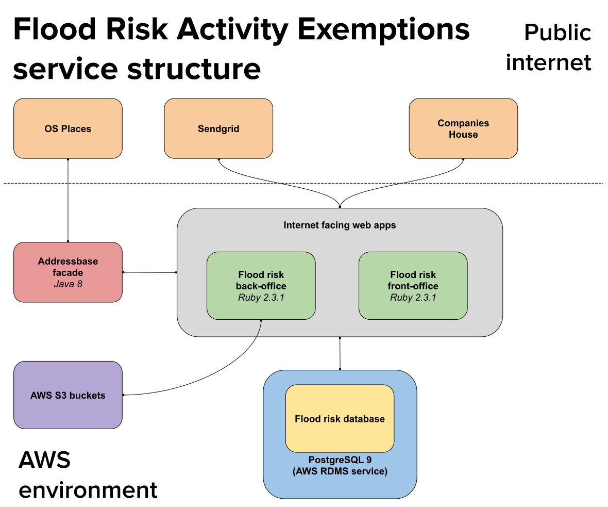

# Register your flood risk activity exemptions

To quote the main guidance page.

> You may need an environmental permit if you want to work in, over, under or near a main river or flood or sea defence.
>
> Some flood risk activities are exempt from needing a permit and you can carry out the work if you register an exemption.

The service itself is built from 3 different repositories

- [Flood risk front office](https://github.com/DEFRA/flood-risk-front-office)
- [Flood risk back office](https://github.com/DEFRA/flood-risk-back-office)
- [Flood risk engine](https://github.com/DEFRA/flood-risk-engine)

## Maintenance only

Currently the team support the service in a maintenance only mode. No new features or improvements are taking place.

We are responsible for ensuring dependencies are kept up to date, and investigating and resiolving any issues that are reported.

## Additional info

The following pages hold additional information about the service.

- [Multiple organisation addresses](multiple_address_issue.md)
- [State machine](state_machine.md)
