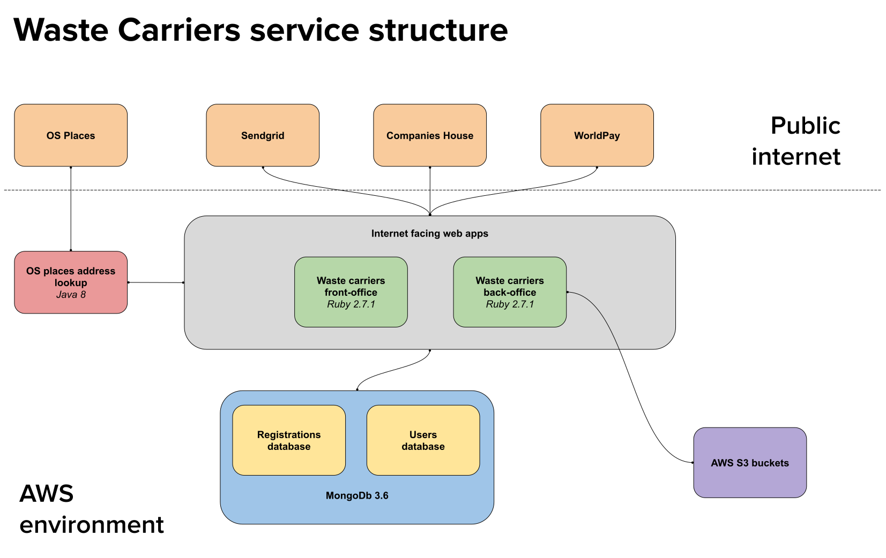

# Register as a Waste carrier

To quote the description on the main project README

> The Waste Carrier Registrations Service allows businesses, who deal with waste and thus have to register according to the regulations, to register online. Once registered, businesses can sign in again to edit their registrations if needed.
>
> The service also allows authorised agency users and NCCC contact centre staff to create and manage registrations on other users behalf, e.g. to support 'Assisted Digital' registrations. The service provides an internal user account management facility which allows authorised administrators to create and manage other agency user accounts.

The [start page](https://www.gov.uk/waste-carrier-or-broker-registration) for the service has more details about waste carrier registration in general.

## High level overview

The core of the service is two Ruby on Rails web apps: one for external users and the other for internal users.

They were built in accordance with what has become our standard model for Rails-based digital services: two host web apps that mount a Rails engine which contains the core functionality.

Unlike our other Ruby services, this one uses MongoDb for the database.

## Repositories

Currently the service is made up of the following repositories:

- [Waste carriers engine](https://github.com/DEFRA/waste-carriers-engine) - Rails engine which contains shared functionality like user journeys, including registration and renewal. Also includes all registration-related models, and is built to be mounted by a host Rails web app.
- [Waste carriers front office](https://github.com/DEFRA/waste-carriers-front-office) - Ruby on Rails web app used by external users to register and renew. Also contains the main user dashboard for front office users who have accounts. Mounts the waste-carriers-engine.
- [Waste carriers back office](https://github.com/DEFRA/waste-carriers-back-office) - Ruby on Rails web app used by internal users to support registrations and renewals. They can complete user journeys as part of assisted digital support using the app as it mounts the waste-carriers-engine. But it also includes functionality for approving conviction matches, adding payments, searching for and viewing renewals, editing registrations, and transferring registrations between accounts.
- [OS Places address lookup](https://github.com/DEFRA/os-places-address-lookup) - Java web app built using Dropwizard which provides a facade to the OS places API. We're the only service that uses it. All subsequent services used the [Address Facade Service](https://github.com/DEFRA/ea-address-facade) or go direct.

## History and previous iterations of the service

The original service was built as

- web application built in Ruby on Rails
- service API built in Java Dropwizard

It used a MongoDb document-orientated database, but also Redis to store inflight registrations.

This original implementation was known to have substantial technical debt, with lack of tests, non-adherence to conventions, and poor code quality being the main issues. Also in hindsight the solution was felt to be overly complicated for what was actually needed.

In 2018 renewals functionality was added to the service, but rather than add it to the existing code base two new applications were built. Both were Ruby on Rails web apps; one for external users and the other for internal users.

In summer of 2020, all remaining functionality was moved from the legacy Rails app and Java service into the new engine, front office and back office. The old apps were removed from production in October 2020.

Archived repositories:

- [Waste carriers frontend](https://github.com/DEFRA/waste-carriers-frontend) - Original Ruby on Rails web app that includes both external and internal user functionality. Handled new registrations.
- [Waste carriers service](https://github.com/DEFRA/waste-carriers-service) - Java back end RESTful services layer built using Dropwizard. The intention was to build a thin client with all logic based in the API, however this never happened. Instead served as essentially a data access layer for registrations.

## Additional info

The following pages hold additional information about the service.

- [Activation and Expiration](activation_expiration.md)
- [Airbrake](airbrake.md)
- [Background jobs](background_jobs.md)
- [Database seeding](database_seeding.md)
- [Entity matching](entity_matching.md)
- [Grace window](grace_window.md)
- [Key people](key_people.md)
- [Making a payment with WorldPay](payment_with_worldpay.md)
- [Organisation type translation matrix](org_type_matrix.md)
- [Preparing for a release](preparing_for_a_release.md)
- [Registration status](registration_status.md)
- [Renewals](renewals.md)
- [Renewal window](renewal_window.md)
- [Valid responses from Companies House](companies_house_responses.md)

Defunct documentation:

- [Importing IR records](defunct/importing_ir_records.md)
- [Maintenance mode](defunct/maintenance_mode.md)
- [Migrations](defunct/migrations)
- [Seeding for load tests](defunct/seeding_for_load_tests.md)
- [Supported http requests for the old Java service](defunct/supported_http_requests.md)
