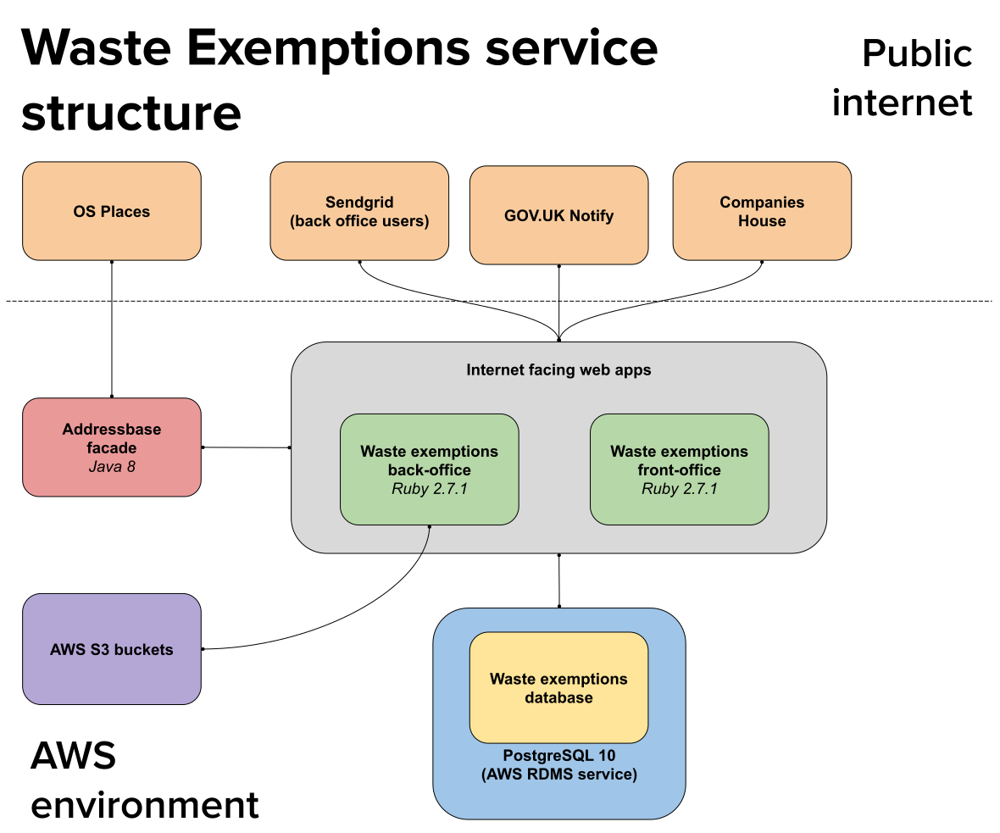

# Register your waste exemptions

To quote the intro on the projects README.

> If your business produces waste or emissions that pollute you may require an environmental permit. However you may also be able to get an exemption if your business activities are considered to be easily controlled and only create low risks of pollution.
>
> The waste exemptions service is used by organisations to apply for an exemption.

The service itself is built from 3 different repositories

- [Waste exemptions front office](https://github.com/DEFRA/waste-exemptions-front-office)
- [Waste exemptions back office](https://github.com/DEFRA/waste-exemptions-back-office)
- [Waste exemptions engine](https://github.com/DEFRA/waste-exemptions-engine)

## History

An initial iteration of the WEX digital service was built and released in March 2016. After the release only critical fixes and the odd enhancement were applied. In 2018 a new team was tasked to look at adding the ability to renew an exemption, though this again went on hiatus until the current team picked the service back up again in 2019.

That version of WEX was put together in a very different way to how the new code on [WCR](/services/wcr) was being put together, and had some technical debt issues (though nothing as bad as WCR). So to make it feasible that a single team could support maintaining multiple services the first task the team completed was to align the WEX code base to WCR.

The aligned version of the service was completed and released in July 2019, and is what we currently work with and maintain.

## Additional info

The following pages hold additional information about the service.

- [Activation and Expiration](activation_expiration.md)
- [Background jobs](background_jobs.md)
- [Renewal window](renewal_window.md)
- [Renewal reminders](renewal_reminders.md)
